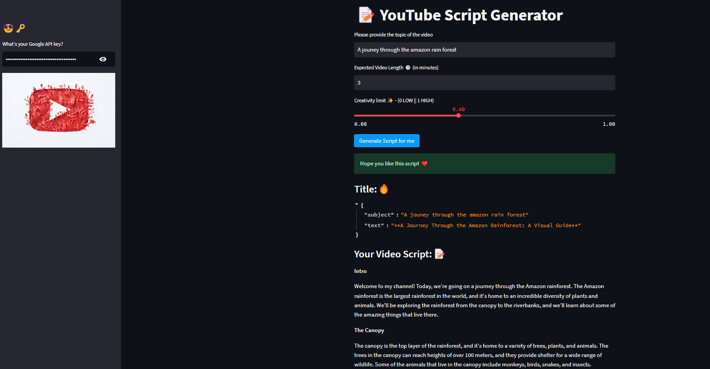
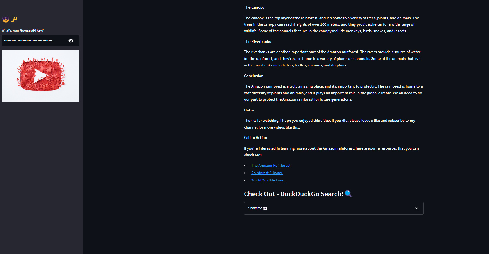

Youtube Script Writing Tool
=============================

Project Overview
----------------
This project aims to develop a YouTube Script Generator, a tool designed to assist content creators in generating scripts for YouTube videos. The tool utilizes Streamlit for the user interface and integrates with Google Palm for natural language processing capabilities.

The workflow begins with the user providing the topic of the video and the expected video length in minutes. Additionally, the user can adjust the creativity limit using a slider, which controls the level of creativity in the generated script.

Upon submission, the tool generates a script for the YouTube video based on the provided inputs. It utilizes the Google Palm API to generate creative and engaging content while adhering to the specified topic and length constraints.

The user interface provides a streamlined experience, with a sidebar for inputting the Google API key and the main section for entering the video topic, expected length, and creativity limit. Upon generating the script, the tool displays the title, generated script, and a search engine result for further reference.

Overall, the YouTube Script Generator enhances the content creation process for YouTube videos by providing creators with a convenient tool to generate engaging scripts tailored to their desired topics and lengths.

Code: utils
-----------
.. literalinclude:: C:/Users/USER/Documents/My GitHub Folder/LLM Projects/LLM-Projects/1. Youtube Script Writing Tool/utils.py
   :language: python

Code: Application
-----------------
.. literalinclude:: C:/Users/USER/Documents/My GitHub Folder/LLM Projects/LLM-Projects/1. Youtube Script Writing Tool/Application.py
   :language: python

Results
-------

.. 

