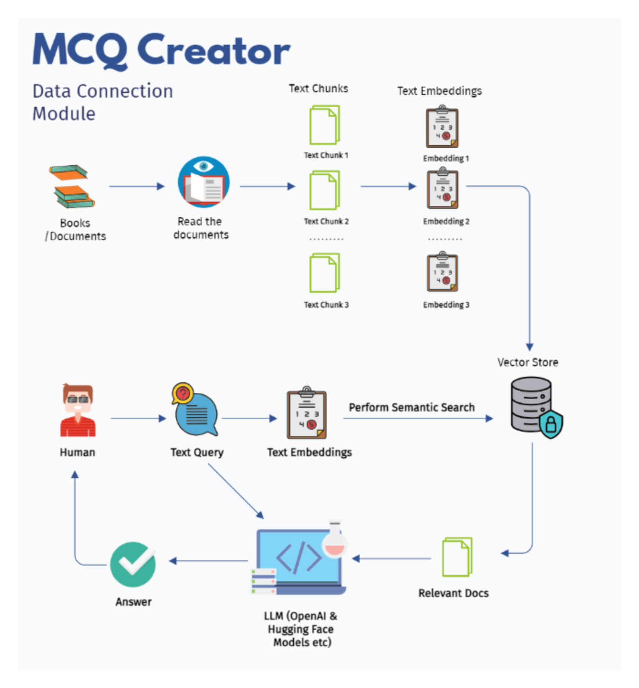
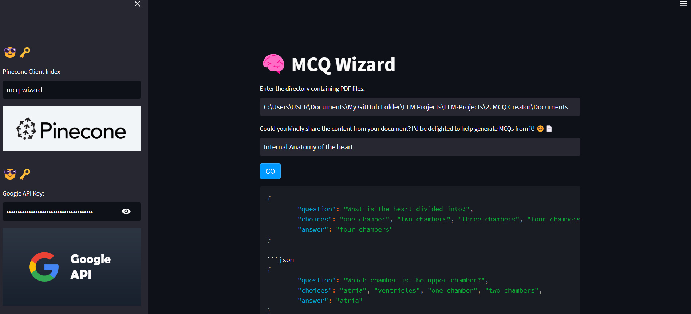
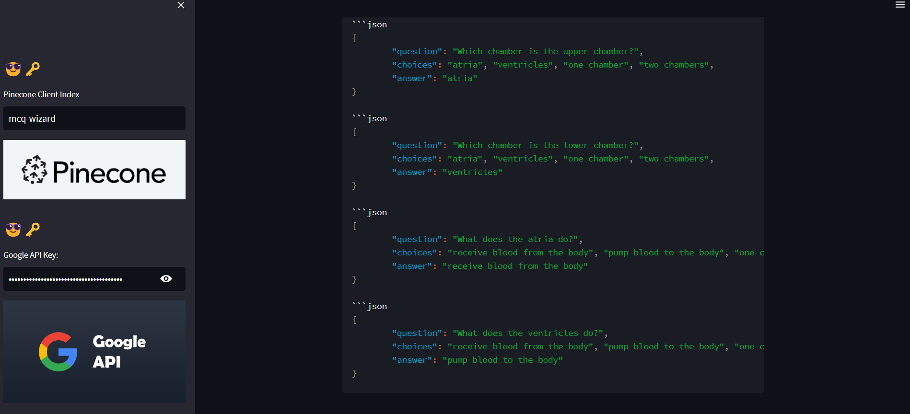

.. MCQ - Wizard documentation master file, created by
   sphinx-quickstart on Sun Apr 21 13:43:38 2024.
   You can adapt this file completely to your liking, but it should at least
   contain the root `toctree` directive.

MCQ - Wizard!
=============

Project Overview
----------------
This project aims to develop an MCQ (Multiple Choice Question) Wizard, a tool designed to generate multiple-choice questions from provided text content. The tool utilizes various technologies such as Streamlit for the user interface, Pinecone for vector storage and similarity search, Google Palm for language model capabilities, and Sentence Transformer for document embeddings. 
The workflow begins with the user inputting text content, typically sourced from PDF documents. The tool then processes this content using Hugging Face LLM to create document embeddings. These embeddings are stored in Pinecone for efficient similarity search.

Upon receiving the text input, the tool generates five multiple-choice questions along with the correct answers. This process involves retrieving relevant documents from Pinecone based on the input text, using Google Palm to formulate questions, and finally presenting the questions and answers to the user.
The tool offers a user-friendly interface with Streamlit, allowing users to input the directory containing PDF files and the desired text content. It also provides options to input necessary API keys for Pinecone and Google Palm. Furthermore, the interface displays instructions and feedback throughout the process to guide the user effectively.
Overall, the MCQ Wizard serves as a valuable tool for educators, content creators, and anyone needing to quickly generate multiple-choice questions from text content, streamlining the question creation process and enhancing productivity.

Work Flow
---------

Code: utils
-----------
.. literalinclude:: C:/Users/USER/Documents/My GitHub Folder/LLM Projects/LLM-Projects/2. MCQ Creator/utils.py
   :language: python

Code: Application
-----------------
.. literalinclude:: C:/Users/USER/Documents/My GitHub Folder/LLM Projects/LLM-Projects/2. MCQ Creator/Application.py
   :language: python

Results
-------

.. 

